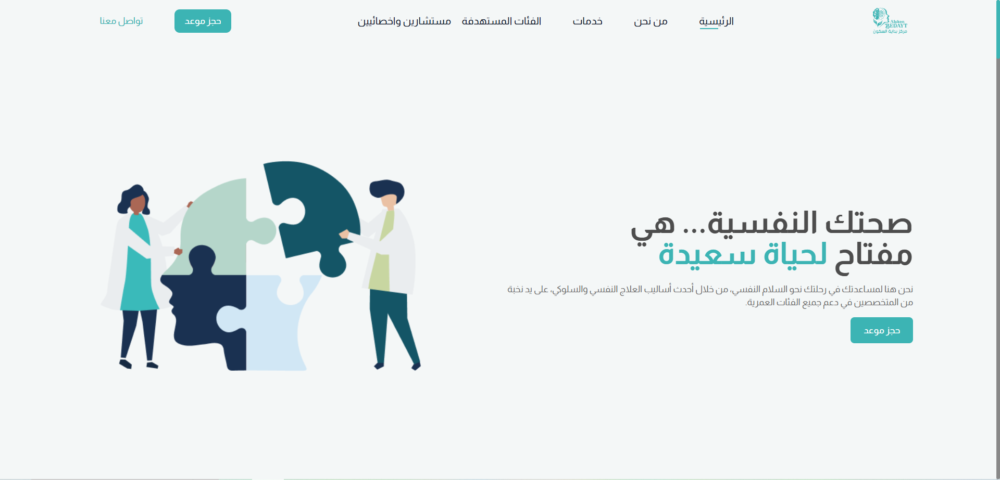

# Bedayt - Mental Health Platform 🌱

[](https://reactjs.org/)
[](https://tailwindcss.com/)
[](https://vercel.com)

 <!-- Add your actual screenshot -->

> "Your mental health is the key to a happy life" - A platform dedicated to psychological well-being for Arabic-speaking communities.

## 🌐 Live Demo

👉 [https://bedayt.vercel.app/](https://bedayt.vercel.app/)

## ✨ Features

- Culturally-sensitive mental health resources in Arabic
- Responsive design for all devices
- Modern UI with smooth animations
- Age-specific content sections
- Easy-to-navigate interface

## 🎯 Target Audience

- Children & Adolescents
- Adults & Working Professionals
- Elderly Population
- Married Couples
- Mental Health Practitioners

## 🛠 Tech Stack

| Technology   | Purpose                   |
| ------------ | ------------------------- |
| React        | Frontend framework        |
| Tailwind CSS | Utility-first CSS styling |
| React Slick  | Interactive carousels     |
| React Icons  | Comprehensive icon set    |
| Flowbite     | UI component library      |
| Vercel       | Cloud deployment platform |

## 🚀 Getting Started

### Prerequisites

- Node.js (v16 or later)
- npm (v8 or later)

### Installation

```bash
# Clone the repository
git clone https://github.com/your-username/bedayt.git

# Navigate to project directory
cd bedayt

# Install dependencies
npm install
# or
yarn install

# Start development server
npm start
# or
yarn start
```
